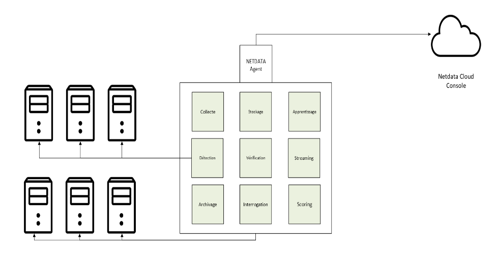
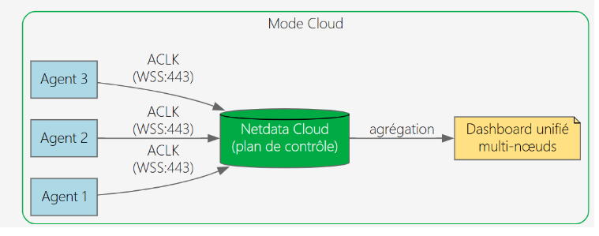
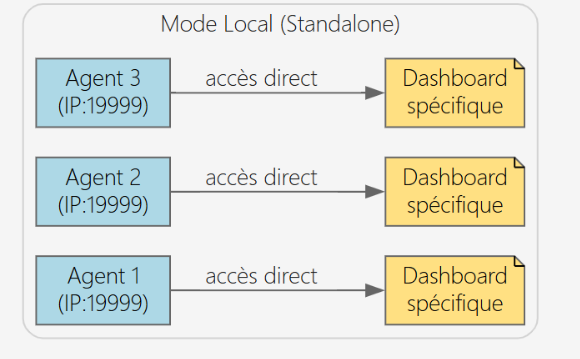
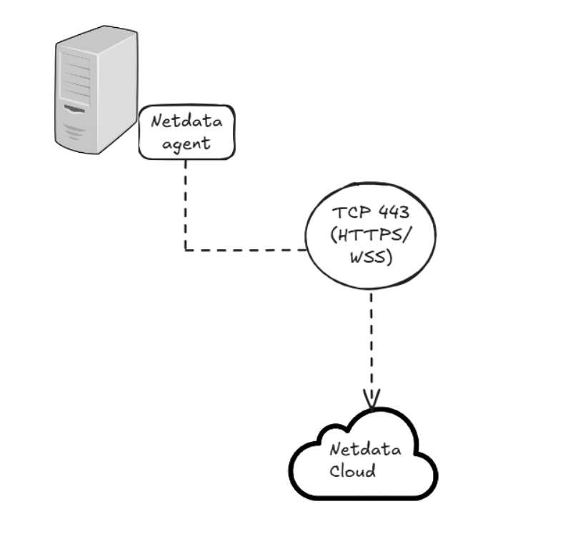
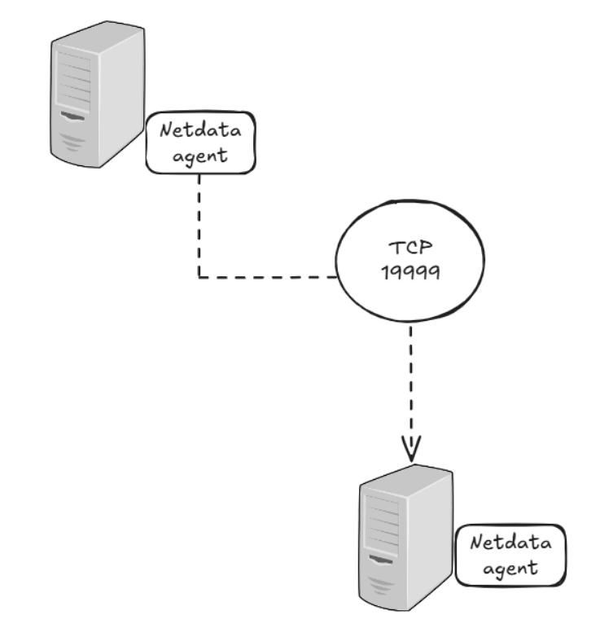

# Architecture & System Design

This document details the architectural choices, security considerations, network protocols, and overall design patterns implemented in this enterprise monitoring deployment.

---

## 1. Netdata Agent: Architecture & Data Collection

Netdata Agent operates directly on the monitored endpoints as a lightweight, real-time metrics collector.

* **Metric Collection:** Captures thousands of per-second metrics natively from CPU, memory, disk I/O, network interfaces, process trees, and system services.
* **Low Footprint:** Written in C, consuming minimal CPU (< 1%) and RAM (~50-100MB depending on metric history retention).
* **Local Storage:** Stores high-resolution time-series data locally using its database engine (DBENGINE), eliminating the need for external database infrastructure for basic operations.

---

## 2. Local Mode vs. Cloud Integration

Depending on enterprise constraints, Netdata can operate in two distinct modes:

| Feature | Local Mode (Standalone) | Netdata Cloud Integration |
| :--- | :--- | :--- |
| **Data Location** | 100% on-premise local node | Metrics stored locally; streaming telemetry to Cloud |
| **Access Control** | Per-node Web UI (`http://node-ip:19999`) | Centralized SSO, RBAC, and unified workspace |
| **Dashboards** | Single-node view | Custom cross-node dashboards & composite graphs |
| **Alerting** | Local scripts / SMTP / Webhooks | Centralized alert notification integrations (Slack, PagerDuty, Teams) |
| **Use Case** | Air-gapped networks & strict isolation | Distributed multi-server enterprise infrastructure |

Mode Cloud : 

Mode Local :

---

## 3. Network Communication & Security Protocols

### Agent to Netdata Cloud
* **Protocol:** WebSockets over TLS (`wss://`)
* **Outbound Port:** `443` (HTTPS)
* **Security Model:** Netdata Agents initiate an **outbound-only** connection to the cloud architecture (CLAIMING protocol). No inbound ports need to be opened on the target server firewall, drastically reducing the attack surface.

### Parent-Child Streaming Architecture (High Scale)
In multi-node enterprise environments, child agents stream metrics to a centralized on-premise Parent node to optimize WAN bandwidth and firewall rules:

* **Protocol:** Netdata Stream Protocol (ACOP) over TCP (TLS supported)
* **Port:** `19999` (Default stream port between Child and Parent)
* **Data Flow:**
  1. **Child Agents** capture metrics and stream to **Parent Server** via port `19999` (Internal network traffic).
  2. **Parent Server** aggregates metrics and maintains local history.
  3. **Parent Server** connects outbound to **Netdata Cloud** via port `443`.

---

## 4. Final Implemented Client Architecture

For the client, a secure cloud architecture was chosen according to their needs and security policy, providing centralized management alongside strict network rules.

### Key Architectural Choices:
1. **Multi-OS Support:** Automated agent deployment across Windows Server, RHEL, Debian, and Ubuntu environments.
2. **Network Perimeter Compliance:** Standardized all cloud telemetry through outbound port `443`, avoiding complex inbound firewall exceptions.
3. **Grafana Integration for Global Visibility:** Integrated Netdata Cloud with an on-premise Grafana server. Because the client used other monitoring tools for infrastructure located in different countries, connecting Netdata to Grafana provided a single, unified "pane of glass" dashboard across all global sites and platforms.
3. **Logical Grouping (Rooms & Labels):** Categorized nodes using custom metadata labels (e.g., `env=production`, `os=windows`, `site=paris`) to dynamically organize Netdata Cloud Rooms.
4. **Grafana Integration:** Connected metric endpoints through central collectors directly to Grafana for long-term reporting and unified operations center (NOC) dashboards.
